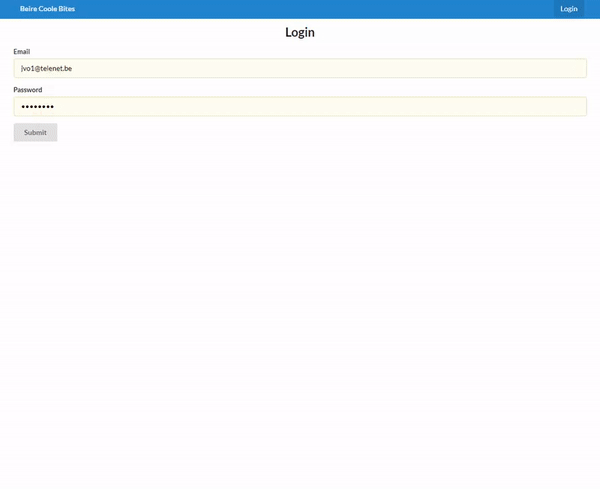

# [BeireCooleBites](http://dieterdeschrijver.be/) (WEBIV PROJECT 2020) - BACKEND

BeireCooleBites is a web application designed for people who want to register online for the BeireCooleBites week. It is an initiative by Beire Cool where they sell lunch to the benefit of 'De Warmste Week'.

Not only this but the application includes a fully functional managing platform for all the days and menus.



## Getting Started

### Installing

* Clone the repository:
```
git clone https://github.com/Web-IV/1920-a1-be-DieterDeSchrijver.git
```

* Run the project:
```
dotnet run
```

* Open [https://localhost:5001/swagger](https://localhost:5001/swagger) to view the swagger page in your browser.

### API endpoints : 
##### Swagger
- /swagger : full API documentation
##### Authentication
- POST /api/login : login to the application
##### Day
- GET /api/Day : list of all days
- POST /api/Day : create a new day
- GET /api/Day/{id} : a specific day
- DELETE /api/Day/{id} : delete a specific day
- POST /api/register : register to a specific day
##### Menu
- GET /api/Menu : list of all menus
- POST /api/Menu : create a menu
- GET /api/Menu/{id} : a specific menu
- PUT /api/Menu/{id} : update a specific menu
- DELETE /api/Menu/{id} : delete a specific menu
- GET /api/allergies : list of all allergies

## Author

This project was started by [Dieter De Schrijver](https://github.com/DieterDeSchrijver)

## Built with

* [ASP.NET CORE](https://dotnet.microsoft.com/apps/aspnet) - The framework used

